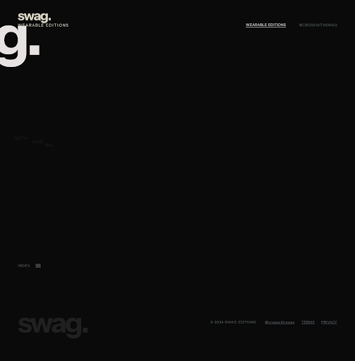
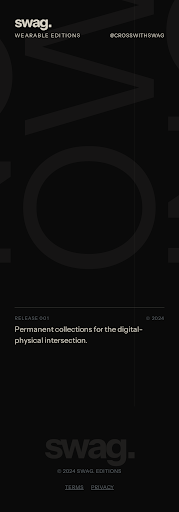
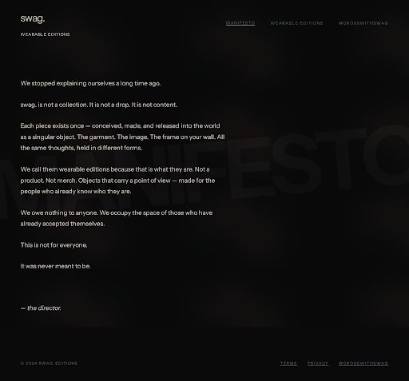
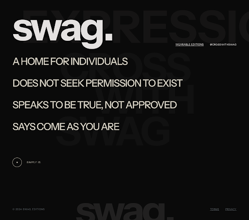
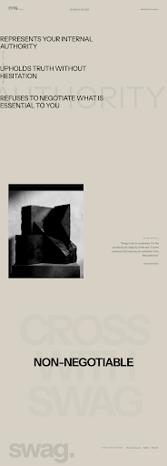
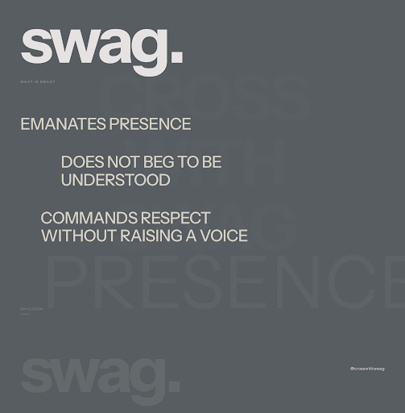
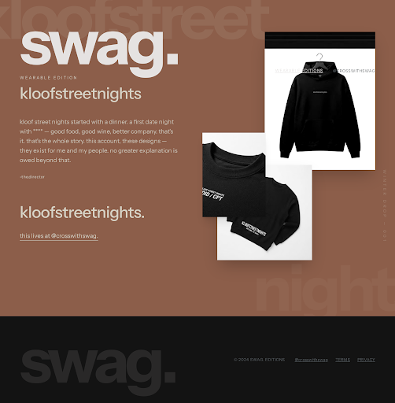
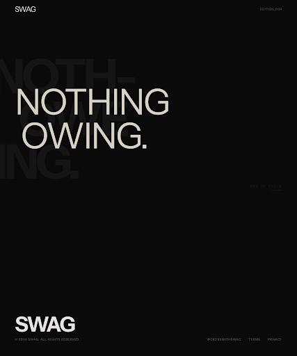

# Stitch Screen Review — swag. V1

**Date:** 6 July 2026  
**Status:** Screens imported from Stitch — awaiting Marcus visual approval  
**Reviewer:** Marcus  
**Stitch project:** Swag Digital Gallery (`projects/13963128826767633115`)

---

## How to review

View exported screenshots in `swag-v1-stitch-compositions/screens/` or HTML exports in `swag-v1-stitch-compositions/html/`.

**Do not judge copy** — all text is locked per Phase 0 sign-off. Review layout, hierarchy, colour, bleed treatment, photography placement, and overall gallery feel only.

---

## Review checklist

### Hero
- [ ] Tagline `WEARABLE EDITIONS` hierarchy correct?
- [ ] Custom wordmark placement and scale OK?
- [ ] Ghost watermark `NOTH- / OWE / ING.` reads as atmosphere?
- [ ] Mobile variant (`01-hero-mobile.png`) acceptable?

### Manifesto
- [ ] Line breaks and body hierarchy feel editorial?
- [ ] Sign-off `— the director.` placement OK?
- [ ] Whitespace balance right?

### SWAG posters (Expression, Authority, Presence, Weight)
- [ ] Statement modules feel distinct per section?
- [ ] Bleed words (EXPRESSION, AUTHORITY, PRESENCE, WEIGHT) intentional at scale?
- [ ] Colour sequence reads: Black → Sand → Stone → Stone?
- [ ] No card/button/ecommerce patterns crept in?

### Edition (kloofstreetnights)
- [ ] Winter Drop campaign photography placement and scale?
- [ ] Clay background + Sand type contrast?
- [ ] Story copy pacing?
- [ ] CTA `this lives at @crosswithswag.` placement?

### Closing
- [ ] `NOTHING` / `OWING.` monumental scale?
- [ ] Negative space treatment?

### Overall
- [ ] All four brand colours accurate (`#0A0A0A`, `#575D61`, `#8C5E4A`, `#D6D1C4`)?
- [ ] Instrument Sans rendering correct?
- [ ] Feels like typographic gallery, not SaaS or streetwear sale site?

---

## Marcus feedback

_(Marcus to fill in after review)_

**Approved as-is:**
- [ ] Yes — proceed to implementation polish
- [ ] No — revisions needed (list below)

**Revisions requested:**

1. 
2. 
3. 

---

## Screenshots

### Full scroll reference

### Individual screens

---

## Gate

**No site implementation changes until Marcus marks approval above.**

After approval: translate Stitch compositions into section layout polish (Phase 5). Live Vercel deploy stays as-is until then.
